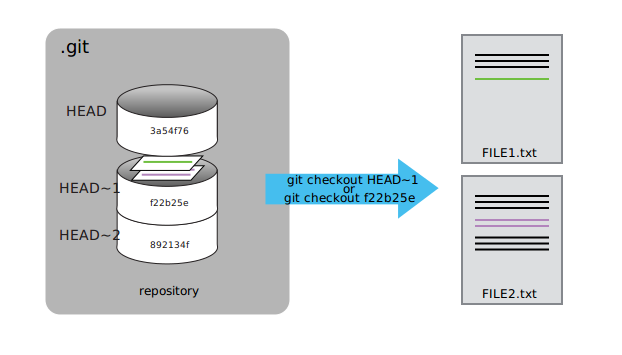
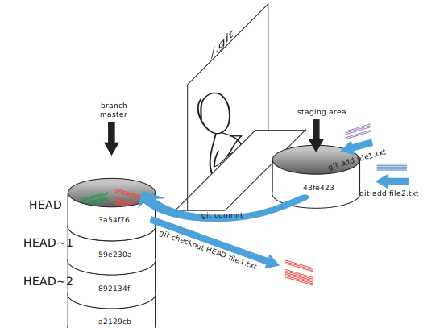

| [⬅ 3. Tracking changes](03-tracking-changes.md) | [Table of Contents](00-contents.md) | [5. Working with branches ➡](05-branches.md) |
| :---- |:----:| ----:|

# 4. Exploring History

As we saw in the previous lesson, we can refer to commits by their
identifiers.  You can refer to the _most recent commit_ of the working
directory by using the identifier `HEAD`.

We've been adding one line at a time to `mars.txt`, so it's been easy to track our
progress just by looking at it, but now let's track progress "using our HEADs" (ha ha).  First,
make one more change to `mars.txt`.

```
$ vi mars.txt
$ cat mars.txt
Mild and dry, but everything is my favorite color
The two moons may be a problem for Wolfman
But the Mummy will appreciate the lack of humidity
An ill-considered change
```


Now, let's see what we get.

```
$ git diff HEAD mars.txt
diff --git a/mars.txt b/mars.txt
index b36abfd..0848c8d 100644
--- a/mars.txt
+++ b/mars.txt
@@ -1,3 +1,4 @@
 Mild and dry, but everything is my favorite color
 The two moons may be a problem for Wolfman
 But the Mummy will appreciate the lack of humidity
+An ill-considered change.
```


This is the same as what you would get if you leave out `HEAD` (try it).  The real power of HEAD comes into play when we use it as a starting point for counting backward in the history of commits.  For example, by adding `~1` (note the use of a tilde, not a minus sign), we can refer to the commit one before `HEAD`.

```
$ git diff HEAD~1 mars.txt
```

If we want to see what we changed at different steps, we can use `git diff`
again, but with the notation `HEAD~1`, `HEAD~2`, and so on, to refer to old
commits:

```
$ git diff HEAD~1 mars.txt
diff --git a/mars.txt b/mars.txt
index 315bf3a..b36abfd 100644
--- a/mars.txt
+++ b/mars.txt
@@ -1,2 +1,3 @@
 Mild and dry, but everything is my favorite color
 The two moons may be a problem for Wolfman
+But the Mummy will appreciate the lack of humidity
```


```
$ git diff HEAD~2 mars.txt
diff --git a/mars.txt b/mars.txt
index df0654a..b36abfd 100644
--- a/mars.txt
+++ b/mars.txt
@@ -1 +1,3 @@
 Mild and dry, but everything is my favorite color
+The two moons may be a problem for Wolfman
+But the Mummy will appreciate the lack of humidity
```


In this way,
we revisit a chain of commits.
The most recent end of the chain is referred to as `HEAD`;
and we refer to previous commits using the `~` notation,
so `HEAD~1` (pronounced "head minus one")
means "the previous commit",
while `HEAD~123` goes back 123 commits from where we are now.

We can also refer to commits using
those long strings of digits and letters
that `git log` displays.
These are unique IDs for the changes,
and "unique" really does mean unique:
every change to any set of files on any computer
has a unique 40-character identifier.
Our first commit was given the ID
f22b25e3233b4645dabd0d81e651fe074bd8e73b,
so let's try this:

```
$ git diff f22b25e3233b4645dabd0d81e651fe074bd8e73b mars.txt
diff --git a/mars.txt b/mars.txt
index df0654a..b36abfd 100644
--- a/mars.txt
+++ b/mars.txt
@@ -1 +1,3 @@
 Mild and dry, but everything is my favorite color
+The two moons may be a problem for Wolfman
+But the Mummy will appreciate the lack of humidity
```


That's the right answer,
but typing out random 40-character strings is annoying,
so Git lets us use just the first few characters:

```
$ git diff f22b25e mars.txt
diff --git a/mars.txt b/mars.txt
index df0654a..b36abfd 100644
--- a/mars.txt
+++ b/mars.txt
@@ -1 +1,3 @@
 Mild and dry, but everything is my favorite color
+The two moons may be a problem for Wolfman
+But the Mummy will appreciate the lack of humidity
```


All right! So
we can save changes to files and see what we've changed. Now how
can we restore older versions of things?
Let's suppose we accidentally overwrite our file:

```
$ echo "hi" > mars.txt
$ cat mars.txt
hi
```


`git status` now tells us that the file has been changed,
but those changes haven't been staged:

```
$ git status
# On branch master
# Changes not staged for commit:
#   (use "git add <file>..." to update what will be committed)
#   (use "git checkout -- <file>..." to discard changes in working directory)
#
#	modified:   mars.txt
#
no changes added to commit (use "git add" and/or "git commit -a")
```


We can put things back the way they were
by using `git checkout`:

```
$ git checkout HEAD mars.txt
$ cat mars.txt
Mild and dry, but everything is my favorite color
The two moons may be a problem for Wolfman
But the Mummy will appreciate the lack of humidity
```


As you might guess from its name,
`git checkout` checks out (i.e., restores) an old version of a file.
In this case,
we're telling Git that we want to recover the version of the file recorded in `HEAD`,
which is the last saved commit.
If we want to go back even further,
we can use a commit identifier instead:

```
$ git checkout f22b25e mars.txt
```


## Don't Lose Your HEAD

Above we used

```
$ git checkout f22b25e mars.txt
```

to revert mars.txt to its state after the commit f22b25e.
If you forget `mars.txt` in that command, git will tell you that "You are in
'detached HEAD' state." In this state, you shouldn't make any changes.
You can fix this by reattaching your head using `git checkout master`

If you were trying to revert not just one file but a whole commit, then you want to
go back to master (`git checkout master`) and use either `git reset --hard [commit ID]` or `git revert [commit ID]`. 
The former will erase all commits after that ID while the latter will make a new commit undoing your changes starting
from that ID, thus preserving the history of wrong commits. Alternatively, 
you can start a new branch from an entire previous status of the master branch when you're in the detached HEAD state. Just don't make changes to master when in that state.

It's important to remember that
we must use the commit number that identifies the state of the repository
*before* the change we're trying to undo.
A common mistake is to use the number of
the commit in which we made the change we're trying to get rid of.
In the example below, we want to retrieve the state from before the most
recent commit (`HEAD~1`), which is commit `f22b25e`:



So, to put it all together,
here's how Git works in cartoon form:




The fact that files can be reverted one by one
tends to change the way people organize their work.
If everything is in one large document,
it's hard (but not impossible) to undo changes to the introduction
without also undoing changes made later to the conclusion.
If the introduction and conclusion are stored in separate files,
on the other hand,
moving backward and forward in time becomes much easier.

# Discuss with partner

## Recovering Older Versions of a File

Jennifer has made changes to the Python script that she has been working on for weeks, and the
modifications she made this morning "broke" the script and it no longer runs. She has spent
~ 1hr trying to fix it, with no luck...

Luckily, she has been keeping track of her project's versions using Git! Which commands below will
let her recover the last committed version of her Python script called
`data_cruncher.py`?

1. `$ git checkout HEAD`
2. `$ git checkout HEAD data_cruncher.py`
3. `$ git checkout HEAD~1 data_cruncher.py`
4. `$ git checkout <unique ID of last commit> data_cruncher.py`
5. Both 2 and 4

## Getting Rid of Staged Changes
`git checkout` can be used to restore a previous commit when unstaged changes have
been made, but will it also work for changes that have been staged but not committed?
Make a change to `mars.txt`, add that change, and use `git checkout` to see if
you can remove your change.

## Explore and Summarize Histories

Exploring history is an important part of git, often it is a challenge to find
the right commit ID, especially if the commit is from several months ago.

Imaging the `planets` project has more than 50 files.
You would like to find a commit with specific text in `mars.txt` is modified.
When you type `git log`, a very long list appeared,
How can you narrow down the search?

Recorded that the `git diff` command allow us to explore one specific file,
e.g. `git diff mars.txt`. We can apply the similar idea here.

```
$ git log mars.txt
```


Unfortunately some of these commit messages are very ambiguous e.g. `update files`.
How can you search through these files?

Both `git diff` and `git log` are very useful and they summarize different part of the history for you.
Is that possible to combine both? Let's try the following:

```
$ git log --patch mars.txt
```


You should get a long list of output, and you should be able to see both commit messages and the difference between each commit.

Question: What does the following command do?

```
$ git log --patch HEAD~3 HEAD~1 *.txt
```
